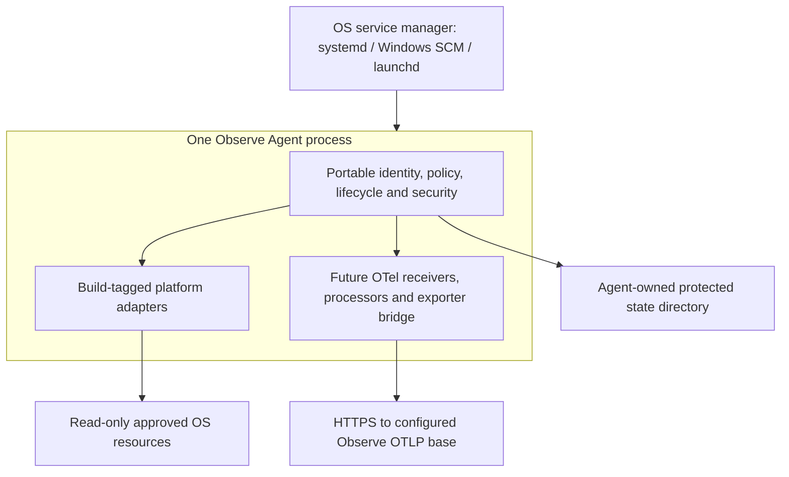
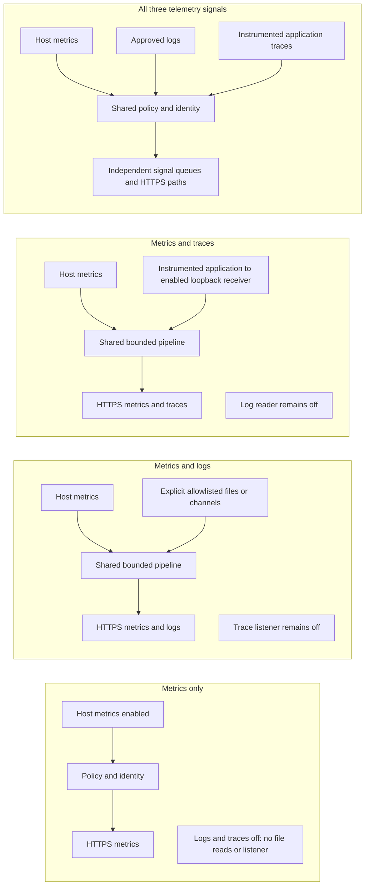

<!-- AGENTV1 FILE START: implemented foundation and proposed extension boundaries -->
# Architecture

> Foundation architecture snapshot. [Linux metrics](LINUX_METRICS.md) supply host readers and the Metrics pdata pipeline, [Linux file Logs](LINUX_FILE_LOGS.md) supply the opt-in secure tailer and Logs pdata pipeline, and [persistent delivery](DELIVERY_RELIABILITY.md) describes the Metrics queue. Metrics and Logs use separate bounded durable queues. Traces and other proposed collectors remain unimplemented.

## Status vocabulary

**Implemented** means exercised by foundation code/tests. **Contract** is a compile-safe interface without a production implementation. **Proposed** requires future engineering and runtime verification. This document is not a claim that unimplemented collectors have undergone syscall or permission auditing.

One portable Go process owns identity, configuration, lifecycle and security. OS adapters contain system calls. Commodity collection should use pinned OpenTelemetry Collector components behind these interfaces; none are embedded yet. No second authentication system or telemetry schema is introduced.

## OS placement (target design)

In plain words: install one service. Enable only the collection capabilities the customer approves. OS-specific adapters read the host; the common core decides what can run and where telemetry can go. Current `--check` is not that service: it only parses a local config file. Linux foreground signal handling exists; SCM/launchd installers do not.

## Data flow (future collector integration)

```mermaid
flowchart LR
  SRC[Enabled OS reader or local OTLP receiver] --> N[Standard OTel signal model]
  N --> P[Bound attributes, validate and apply policy]
  P --> ID[Observe exact identity enrichment]
  ID --> Q[Bounded batch and durable queue]
  Q --> E[OTLP JSON over HTTPS with ApiKey]
  E --> B[Observe tenant authentication and permissions]
  B --> C[Canonical entity correlation and signal storage]
  C --> ACK[Successful acknowledgement]
  ACK --> CP[Commit delivery checkpoint]
```

In plain words: collect, validate, label with stable identity, then send. The backend identifies the organization from the key, not from an untrusted telemetry attribute. Queue deletion must follow acknowledged persistence. Queue, serializer and delivery loop are contracts, not implemented delivery guarantees.

## Enabled capabilities: four separate flows

In plain words: enabling metrics does not grant log-file access or open a trace port. Enabling traces accepts application instrumentation; it does not automatically instrument or alter applications. Processes/containers remain separate explicit permissions even in the all-three-signals profile.

## Core interfaces

| Package / interface | Responsibility | Current implementation |
|---|---|---|
| `identity.MachineReader` | Stable OS identity only | Linux `/etc/machine-id`; Windows/Darwin unsupported |
| `cloud.Detector` | Return trusted detector evidence | Interface only; no IMDS access |
| `platform.HostMetrics` | Samples with explicit unsupported/denied errors | Unsupported placeholders |
| `platform.FileIdentity` | Stable per-file checkpoint identity | Linux device/inode; other OS deferred |
| `platform.StateStore` | Bounded read and atomic replacement | Linux private-directory primitive |
| `platform.Permissions` | Read-only access check; never elevate | Linux explicit read probe, no write probe |
| `platform.Service` | Own cancellation/service lifetime | Linux signals; Windows console only; no SCM |
| `collectors.Factory` / `Collector` | Side-effect-free construction; Start/Stop | Registry contract plus test doubles |
| `app.Store` | Commit last-known-good policy | `fleet.LocalStore` adapter |
| `fleet.Transport` / `Verifier` | Retrieve and authenticate exact policy bytes | No network transport/verifier ships |
| `fleet.Applier` | Apply validated tenant-bound policy | Lifecycle Manager |
| `security.SecretProvider` | Obtain authorization without persisting it in config | Environment reference |
| `pipeline.Builder` / `Prepared`, queue/receiver/processor contracts | Future signal transport boundaries | Interfaces only |
| `selftelemetry.Sink` | Non-secret lifecycle audit events | Discard sink; tests capture events |

Exact signatures live in their Go files. Platform APIs are selected with `//go:build linux`, `windows`, `darwin` and an unsupported fallback. Common packages import no Linux syscall types. Windows/native tests must skip only genuinely OS-specific tests, not portable identity/security tests.

## Identity, not credential identity

Effective **Agent ID**: explicit non-empty config label; otherwise verified EC2 instance ID; otherwise stable machine ID; otherwise error. Empty config is valid.

Canonical **host.id** is separate: verified EC2 instance ID or stable OS machine ID. An explicit display label never becomes a substitute hostname-based canonical identity. An explicit Agent ID may resolve without host.id, preserving the old label behavior, but `RequireHost()` must reject host-correlated collection in that case. There is no random/API-key/IP/DNS fallback. Duplicate cloned OS machine IDs require image provisioning to regenerate the OS machine ID; the Agent does not mutate it.

Verified cloud evidence is supplied by a trusted detector, not a user config boolean. The current boolean is an internal assertion, not signed AWS attestation. A later IMDSv2 detector must validate identity, bound requests and bypass environment HTTP proxies for link-local metadata. Backend exact organization/account/region/instance matching remains authoritative.

Resource attributes preserve `host.id`, `host.name` as a label, `os.type`, `host.arch`, `telemetry.distro.name=agent-i`, distro version and known AWS attributes. Actual application service identity remains separate. No service/host identity is derived from API-key ID. Enrichment must not overwrite application `service.name`, version or instance metadata.

## Capability lifecycle

1. Parse bounded strict config; reject ambiguous/unknown JSON keys.
2. Clone policy and serialize applies. Validate capability names and every enabled implementation before constructing anything.
3. Reject older versions or changed content at the same version; identical same-version replay is a no-op.
4. Stop removed capabilities cooperatively; retain unchanged ones; construct/start newly enabled ones only.
5. If start/apply fails, stop new collectors and restore the previous set. Record a redacted failure event.
6. Save successful policy only after lifecycle success. Storage ambiguity or failed stop/rollback sets degraded state; do not claim success or continue applying changes.

Factories must not read files, bind sockets or start goroutines; Start owns those actions. Stop must cancel readers, close listeners, join owned workers and release resources. Stop timeout is cooperative, not an isolation mechanism for hostile plugins. A hung in-process implementation cannot be force-killed safely; service supervisor termination remains the last resort. Production audit persistence and process supervisor wiring are future work.

## Remote configuration contract

Remote policy is disabled by default (`remote_allowed: []`). Gate input is bounded to 64 KiB. An injected verifier must authenticate exact bytes before returning the envelope. Organization and installation must match authenticated locally pinned scope, expiry must be in the future, policy version must advance, and every enabled capability must fit the local ceiling. API-key scopes are not permission to elevate local OS access.

This phase implements the gate and LKG storage adapter, **not** a backend endpoint, polling loop, cryptographic verifier, enrollment mechanism or startup LKG restoration. Until a backend protocol is approved, no policy is accepted from the network. Organization/installation binding cannot come from caller-controlled URL parameters or unverified resource attributes.

Proposed transport: authenticated outbound HTTPS, one in-flight request, bounded response, timeout and jittered backoff; minimum polling period around 60 seconds unless the approved contract says otherwise. Reject expired/replayed/wrong-tenant data. New higher-version policy may restore old settings; never decrement a version. Disconnect retains local approved policy, not arbitrary remote defaults. Remote schema has no shell, executable path, secret values or exporter destination controls.

## Standard OTel reuse boundary

Next phases should pin and wrap hostmetrics, filelog, journald, windowseventlog, prometheus and OTLP receivers; memory limiter, batch/filter processors; file-storage queue and OTLP serializer/export behavior. Verify component support/license and exact metrics, units, temporality and resource semantics before adoption. Preserve the deployed wire contract through golden tests; do not replace working identity with generic OTel hostname detection. No OTel dependency or custom collector is introduced here.
<!-- AGENTV1 FILE END -->
