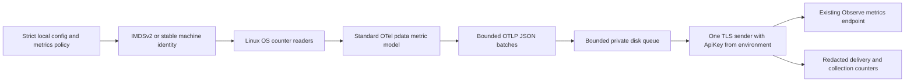

<!-- AGENTV1 FILE START: implemented Linux metrics slice and explicit operational limits -->
# Linux metrics vertical slice

This supersedes the foundation-only runtime statements in the earlier documents. The executable now has an explicit `--run` mode. Linux file Logs were added later as a separate opt-in capability with an independent queue; see [Linux file Logs](LINUX_FILE_LOGS.md). It is **not yet an approved replacement for the deployed Linux Agent**: traces, legacy YAML import and live EC2-to-backend compatibility remain release gates.

## Implemented path



The Metrics capability remains independent from Logs. Disabled metrics do not construct a reader, inspect identity, read the credential or contact an endpoint. `--check` only reads configuration. Traces remain unsupported and fail preflight when enabled.

Pinned reuse:

- OpenTelemetry Collector `pdata v1.60.0`: `pmetric.Metrics`, gauges, cumulative sums and the standard JSON serializer. [Official pdata documentation](https://pkg.go.dev/go.opentelemetry.io/collector/pdata@v1.60.0/pmetric).
- `gopsutil/v4 v4.26.5`: Linux memory, load, network, disk and filesystem adapters. [Pinned adapter documentation](https://pkg.go.dev/github.com/shirou/gopsutil/v4@v4.26.5/disk).
- CPU is a small bounded Linux `/proc/stat` reader. The gopsutil CPU package was deliberately not imported because its package initialization reads CPU counters before capability activation. No custom OTLP wire structures were introduced.

## Exactly what is read

| Signal | Read operations | Emitted metric / meaning |
|---|---|---|
| CPU | `/proc/stat`, maximum 2 MiB; aggregate first eight CPU counters and `btime` | `system.cpu.time` cumulative seconds by state; `host.cpu.used_pct` and `system.cpu.utilization` from two valid observations |
| Memory | `/proc/meminfo`; gopsutil may read `/proc/zoneinfo` for older-kernel available-memory fallback | `system.memory.usage` used/available bytes; utilization = (total - available) / total |
| Load | `/proc/loadavg` | `system.cpu.load_average.1m/5m/15m`; not a percentage |
| Disk I/O | `/proc/diskstats`; gopsutil also stats device nodes and may read `/run/udev/data/b<major>:<minor>`, sysfs model/serial and device-mapper name metadata | `system.disk.io`, operations, operation time; direction read/write and exact device; queue depth gauge |
| Filesystem | `/proc/self/mountinfo` (library fallback may inspect process mount files), `/proc/filesystems`, device symlink metadata; `statfs` only on allowed local types | `system.filesystem.usage` with device/mountpoint/type/state used or available |
| Network | `/proc/net/dev` | Per-interface receive/transmit cumulative bytes, packets, errors and dropped packets; not packet capture |
| Stable non-cloud identity | `/etc/machine-id`, bounded read, valid 32-character lowercase hex only | Canonical host.id; never generated or modified |
| EC2 fallback safety hint | On failed metadata probe, read `/sys/devices/virtual/dmi/id/sys_vendor` and `/sys/hypervisor/uuid` where readable | Recognize EC2 and refuse unsafe machine-ID fallback; hint values are not canonical IDs |
| Config and key | Selected JSON config; environment variable named by `headers_env.Authorization` | No key in YAML/JSON, metric payload, queue, error, or diagnostics |

The filesystem allowlist is ext2/ext3/ext4/xfs/btrfs/zfs/tmpfs/overlay. NFS, CIFS and FUSE are not probed. Mount count, device count, interface count and total sample points are bounded. A blocked local kernel `statfs` is not forcibly interruptible by a Go context; shutdown reports a timeout rather than claiming the worker stopped. Kernel-stall/supervisor handling remains a production soak-test gate.

Gopsutil host-path roots are pinned to the real `/proc`, `/sys`, `/dev`, `/etc`, `/run`, `/var` and `/`; inherited `HOST_*` overrides cannot redirect reads to unrelated files. No process inspection, application log reads, container socket, raw block-device reads or shell subprocesses are used.

## Metric semantics

- CPU total excludes separately adding guest counters (already included in user/nice). Used percent excludes idle + I/O wait. First sample has no fabricated utilization; resets, zero progress, invalid time and gaps over 120 seconds omit the derived utilization.
- Linux exported CPU jiffies use USER_HZ 100 for the supported AMD64/ARM64 platforms; disk milliseconds convert to seconds.
- Disk/network counters remain cumulative monotonic OTel sums with boot-time start timestamp and `_boot_time_unix` evidence. The backend/UI can derive rates. Queue depth and memory/filesystem observations are gauges.
- Device and partition series remain separate. The Agent never sums parent devices and their partitions into a false host total.
- Filesystem usable capacity is used + available; reserved blocks are not falsely available to the service user.
- Missing/denied data is omitted with an explicit collection issue, never replaced with zero. Real zero-valued observations remain valid.
- Self-diagnostics use `host.agent.*` gauges so they remain on the host rather than creating a fake service entity. They include scrape/read errors, queue rejection, export failures, retries, throttles, authorization failures, rejected points, unacknowledged/dropped batches and per-collector issue labels. A batch counted as unsuccessful can include partially accepted points; it is not a claim that the backend discarded every point.

## EC2 identity

At startup, IMDSv2 PUT `/latest/api/token` requests a 60-second metadata token; GET `/latest/dynamic/instance-identity/document` uses that token. No IMDSv1 fallback, proxy or redirect. Overall default deadline is two seconds; token/document limits are 4 KiB/16 KiB. No AWS access keys or IAM modifications are involved.

Account ID, EC2 instance ID, region and AZ prefix are validated. `host.id` remains the exact instance ID. Standard AWS, China and GovCloud ARN partitions are supported; isolated partitions fail explicitly pending verified support. Known resource attributes are preserved and `telemetry.distro.name=agent-i` stays compatible with the backend. Explicit agent_id is a label, not a replacement for EC2 host.id.

On a recognized EC2 host, metadata failure fails startup instead of inventing a standalone identity. Set `ec2_metadata.required=true` in the eventual EC2 deployment profile for fail-closed behavior even when DMI hints are inaccessible. With optional metadata and no detectable EC2 evidence, valid machine-id is the non-cloud fallback; metadata-blocked EC2 without hints cannot be distinguished automatically. The detector is local IMDSv2 validation, not signed instance attestation.

## Queue, delivery and failures

Default scrape interval: 15 seconds. Default caps: 4,096 host points, 128 disks, 64 interfaces and 64 mounts. Batches contain at most 500 points, below the current backend's 2,000-point limit. Serialized byte size is also enforced; oversized batches split recursively.

The FIFO queue is now **persistent**, maximum 64 items and configurable disk accounting (default 64 MiB). It writes versioned checksummed records to a private directory and removes them only after remote acceptance. New data is rejected/counted when full. Snapshot/serialization and in-flight request memory remain outside disk accounting; this is not a hard RSS cap. No credentials are spooled. See [delivery semantics and footprint](DELIVERY_RELIABILITY.md).

The sender:

- Uses the configured HTTPS `/api/v1/otlp/v1/metrics` endpoint, system certificate trust and TLS >=1.2. No insecure TLS config; redirects are rejected.
- Reads the full `ApiKey <key>` authorization from its named environment variable for each attempt. Only payload bytes enter the queue. Header references are cleared after the request; Go/OS memory is not claimed to be cryptographically erased.
- Defaults to 15 seconds/request and four attempts. Transport failures, 5xx and 429 retry; normal backoff is exponential with jitter, capped around 30 seconds.
- Honors numeric/date `Retry-After`, including longer server-requested waits, without shortening it. Waits are cancelable, one worker remains active, and the queue still has fixed bounds.
- Treats 401/403 as permanent for the current process: records auth failure and suspends scraping/export. Correct credentials and restart the process; no repeated auth request storm.
- Does not retry normal 4xx or partially rejected success responses. Both raw OTLP and Observe `data` response envelopes are understood. Response body read is capped at 64 KiB.
- Retries identical serialized payload/timestamps. A lost acknowledgement can replay an already-stored request; backend deduplication must be verified live before an exactly-once claim.

On shutdown, sampling and HTTP requests are canceled, workers are joined with the configured timeout, and retained records remain for restart replay. Retained backlog is not counted as dropped. Permanent authentication/configuration failures pause rather than delete records. Delivery is at-least-once, not exactly-once.

## Permissions, listeners, writes and outbound connections

Run under a restricted service identity able to read proc/sys metadata and traverse approved local mounts. Root/Administrator is not a general requirement. Denied optional reads produce issue telemetry. No permission escalation, chmod of customer files or workload modifications occur.

**No listening ports are opened.** Logs/trace receivers do not exist here. Network consists of startup link-local IMDSv2 and outbound HTTPS metric requests (plus normal DNS/proxy traffic if configured by the service environment). Go's HTTPS transport honors proxy environment variables; the IMDS transport never does.

Runtime writes redacted aggregate diagnostic JSON to stderr once per minute and at shutdown, plus the restricted metrics spool (0700 directory, 0600 records/control files). A service supervisor may retain stderr. It does not write customer config, application logs or deployed identity files. Build/test artifacts under ignored `dist/` are development-only. The Linux reader opens/closes proc files per sample; no application log descriptors are retained.

Runtime concurrency: one sampling goroutine, one sender, one lifecycle join waiter, the service/diagnostic loop and Go/net/http runtime workers. No child processes. Kernel/TLS/runtime thread counts are not fixed.

## Running later, after operator approval

```sh
observe-agent --check --config /path/to/agent.json
observe-agent --run --config /path/to/agent.json
```

Configure a real validated HTTPS base and supply the referenced environment variable through the protected service environment. No actual key is shown here. No service was installed/restarted and no live endpoint was contacted in this task.

See [configuration compatibility design](CONFIG_COMPATIBILITY.md) and [slice validation](METRICS_VALIDATION.md) for evidence and remaining release blockers.
<!-- AGENTV1 FILE END -->
